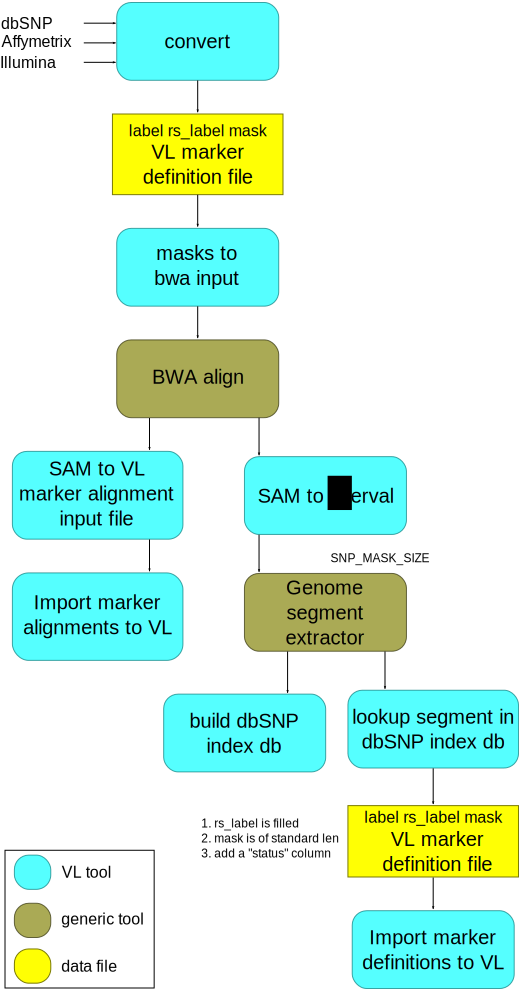

Describing a genotyping technology
==================================

.. todo::

   this example is supposed to show the snp alignment suite of tools
   in action.

In this example, we will show how to do the following.

 * Given a collection of SNPs definitions, basically the collection of
   their snp defining masks, we will run an identification process
   that will check for their presence within a collection of known
   SNP. To provide a concrete example, we will be using the Affymetrix
   GenomeWide 6.0 probeset as an example.

 * Once the SNPs have been, if possible, labelled, their definition
   will be saved in BIOBANK.

 * The saved SNPs will then be aligned to a reference genome and the
   alignment information will be saved in BIOBANK.

 * Check the consistency of the available birdseed priors, i.e., if
   they are consistent with the aligned SNP marker position
   (diploid/haploid). If not, fix-it.

 * Create a SNPMarkersSet for the specific technology.

Workflow:

.. todo::
  
   Birdseed just appeared out of nowhere...

   What do we do when we get a bad haploid/diploid probeset? Put in
   some neutral priors? Something like the 'average' of the category?
